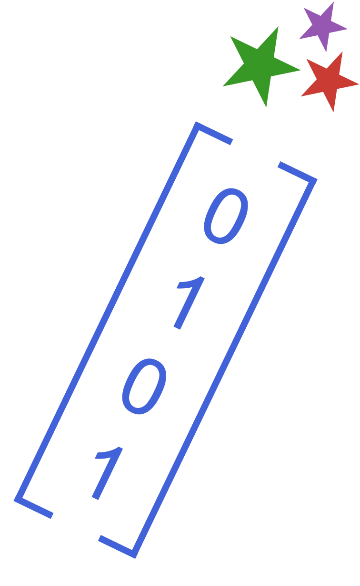

# apMADGICS 

[](https://github.com/andrew-saydjari/apMADGICS.jl/actions/workflows/CI.yml?query=branch%3Amain)
[](https://codecov.io/gh/andrew-saydjari/apMADGICS.jl)


Pipeline for APOGEE spectra using Marginalized Analytic Dataspace Gaussian Inference for Component Separation (MADGICS).

## Installation

This is a pipeline. Not a package. It is not really meant to be installed. The pipeline.jl script is meant to be run. This repo documents the development and versions of the pipeline for transparency and reproducibility.

If you wish to download the code and have the dependencies required to run it installed, you can install directly from GitHub. 

```julia
import Pkg
Pkg.add(url="https://github.com/andrew-saydjari/apMADGICS.jl")
```

## Inputs

The pipeline runs on a list of tuples. Those tuples have the form `(runindx, release_dir, redux_ver, tele, field, plate, mjd, fiberindx)`. 
- `runindx` is arbitrary and is a linear index for file name incrementing when batching. 
- `release_dir` and `redux_ver` specify which version of the data to point at (see examples below). 
- `tele` is either `apo25m` or `lco25m` for the APO or LCO 2.5 meter locations for APOGEE (North and South, respectively). 
- `field` is a pointing identifier, `plate` is a fiber configuration identifier, and `mjd` is a 5-digit rough date index.
- `fiberindex` is the fiberindex (1-300) of the spectra on the CCD. Note that this index is reversed `(301-fibernum)` from the `fibernum` reported in the allVisit and allStar summary files. However, this index is the real index on the CCD... which is by far the more reasonable index to work in.

One example is 
```
(273, "sdsswork/mwm", "daily", "apo25m", "101689", "6455", "59817", 295)
```
which runs an observation from APOGEE-North that has been reduced from 3D -> 1D by the daily pipeline.

Another example is
```
(10, "dr17", "dr17", "apo25m0000010i", "180+60", "9667", "58126", 295)
```
which shows how injection tests are handled. This is an injection test into sky observations from DR17 taken on APOGEE-North. The trailing "i" indicates that it is an injection and the number after "apo25m" is a dummy index to prevent collisions of multiple injections into the same sky observation.

## gridSearch Module Flag Bits

There is still a (much smaller dimensional) space that MADGICS needs to sample over (e.g. radial velocity). We have a custom grid-sampler module to implement that sampling. The flag bits from that module are below.

| Value         | Bit         | Meaning     |
| ----------- | ----------- | ----------- |
| 0     | -     | No problems       |
| 1     | 0     | Interpolated minimum not less than minimum (should not occur) |
| 2     | 1     | Minimum index at edge of grid for dimension 1 |
| 4     | 2     | Minimum index at edge of grid for dimension 2 |
| 8     | 3     | Finite difference Hessian beyond grid edge |
| 16    | 4     | Bad curvature of chi2 surface (can't invert full 2d Hessian)|
| 32    | 5     | Very bad curvature of chi2 surface (can't invert diagonal entries)|


